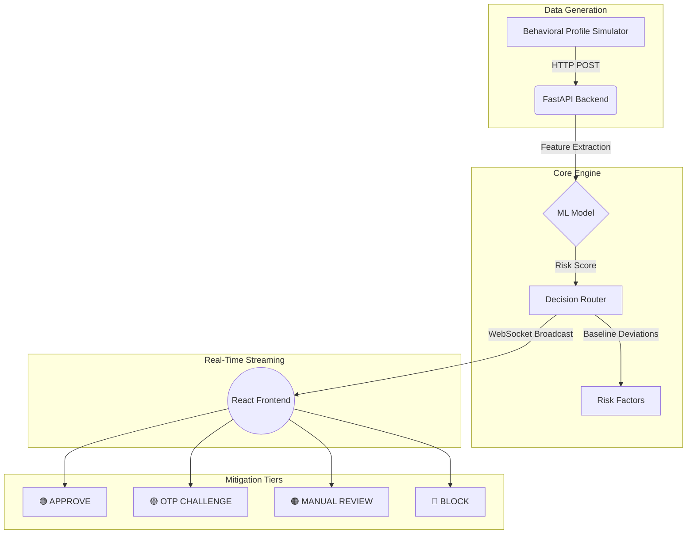

# Adaptive Fraud Response Engine

[](#) *(Replace this link with your live URL once hosted)*

## The Business Problem
Modern fraud detection systems often optimize solely for catching bad actors, which inadvertently creates a massive volume of "false positives." This binary block/allow approach overwhelms human analysts with mundane alerts, introduces significant friction for legitimate users (card declines, locked accounts), and ultimately costs financial institutions millions in lost revenue and customer dissatisfaction. 

## The Solution
The **Adaptive Fraud Response Engine** replaces static thresholding with dynamic, risk-based mitigation strategies. By evaluating streaming transactions against behavioral baselines (e.g., average spend, expected location) using a Machine Learning model, the system assigns a granular risk score. Instead of merely blocking or allowing, the engine deterministically routes transactions into appropriate mitigation actions (e.g., "APPROVE", "OTP_CHALLENGE", "MANUAL_REVIEW", "BLOCK"). This ensures that high-friction actions are reserved only for critical threats, drastically reducing analyst fatigue.

## System Architecture



## Technical Decisions & Tradeoffs

### Fraud Engine Model Selection
Used `scikit-learn`'s **RandomForestClassifier**. 
**Tradeoff:** While highly-optimized libraries like LightGBM are often used in production for tabular data, they require underlying C++ build environments which can cause friction in heterogeneous deployment pipelines. Random Forest was chosen for its extreme portability, solid out-of-the-box performance against overfitting, and zero-dependency friction in standard Python environments.

### Real-Time Streaming Architecture
Used **WebSockets** over HTTP Polling or SSE.
**Tradeoff:** Polling a REST endpoint every few milliseconds creates massive network congestion, high server CPU load, and unnecessary TCP handshakes. We upgraded to an asynchronous WebSocket (`/ws/stream`) architecture. This maintains a persistent, low-latency duplex connection, allowing the FastAPI server to push scored transactions to the React dashboard instantly without client request overhead.

### Asynchronous Concurrency
Used `asyncio.to_thread()` inside the FastAPI endpoint.
**Tradeoff:** Scikit-learn's `predict_proba` is synchronous and CPU-bound. If run directly inside an `async def` FastAPI route, it would block the Python event loop, turning the entire web server strictly serialized. Offloading the model inference to a separate thread pool (`asyncio.to_thread`) allows FastAPI to continue accepting concurrent TCP connections while the model evaluates.

## Performance Benchmarks & Output
- **Throughput:** Capable of handling hundreds of concurrent incoming requests via ASGI asynchronous event loops.
- **Latency:** Core routing and ML inference executed in sub-50ms (hardware dependent).
- **Adaptive Mitigation Distribution:** Synthetic testing yields an ~85% straight-through processing rate (APPROVE), reserving Analyst Queue (MANUAL_REVIEW) to ~5% of traffic.

## FAQs

**Q: Why not use a deep neural network instead of Random Forest for fraud detection?**
**A:** Fraud datasets are typically highly imbalanced tabular data. Tree-based models (like Random Forest or XGBoost) inherently handle non-linear tabular data better and require far less data to train effectively than Deep Learning models. Furthermore, tree-based models offer better explainability (feature importance), which is crucial for compliance in FinTech.

**Q: How to ensure FastAPI server wouldn't crash under load?**
**A:** I built a comprehensive `pytest` suite simulating high-concurrency requests using `asyncio.gather`. Crucially, I identified that CPU-bound ML inference would block the async event loop. I resolved this by offloading the `model.predict()` call to a thread pool executor using `asyncio.to_thread()`, ensuring non-blocking IO. I also utilized Pydantic for rigid type validation, catching "fat-finger" inputs (like string amounts) with graceful 422 errors instead of 500 server crashes.

**Q: What could be changed to scale this for millions of transactions?**
**A:** I would decouple the ingestion from the scoring. The API would act purely as an ingestion layer, immediately dropping the transaction onto an event bus like **Apache Kafka**. A separate pool of worker nodes would consume from Kafka, run the ML inference, and write the result to a fast caching layer (like **Redis**), which the WebSocket servers would subscribe to for frontend broadcast.

## How to Run

1. **Setup & Train the Model**
   ```bash
   python -m venv .venv
   .\.venv\Scripts\activate
   pip install -r backend/requirements.txt
   python backend/train_model.py
   ```

2. **Run the Automated Tests**
   ```bash
   pytest backend/test_api.py -v
   ```

3. **Start the Systems**
   Open three separate terminals:
   
   **Terminal 1 (Backend):**
   ```bash
   uvicorn backend.app:app --reload
   ```
   **Terminal 2 (Frontend):**
   ```bash
   cd frontend
   npm install
   npm run dev
   ```
   **Terminal 3 (Simulator):**
   ```bash
   python backend/simulator.py
   ```
